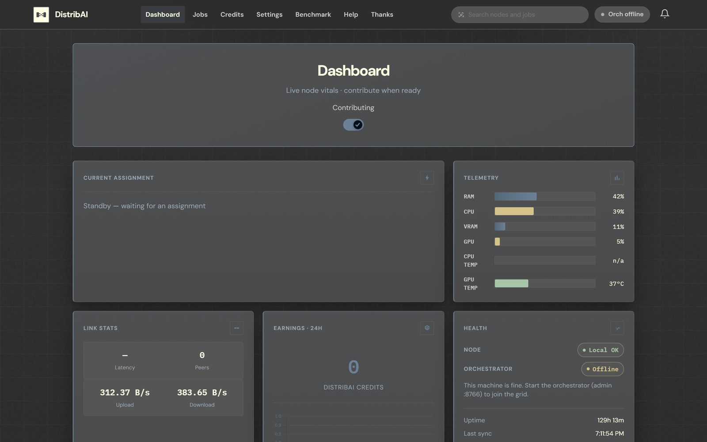
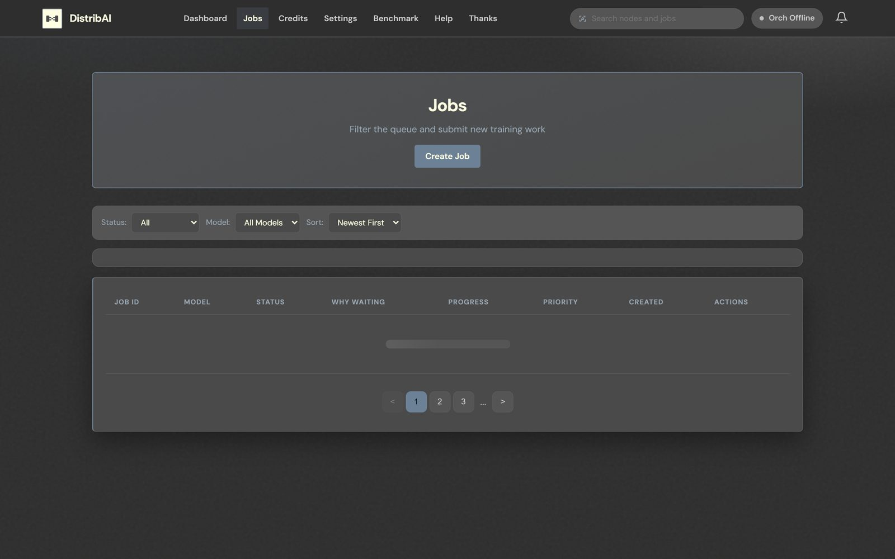
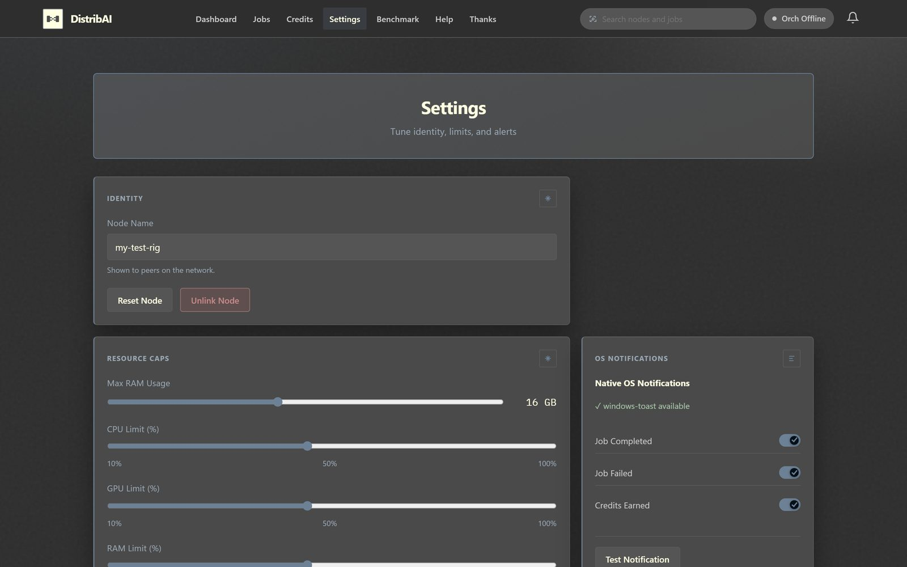
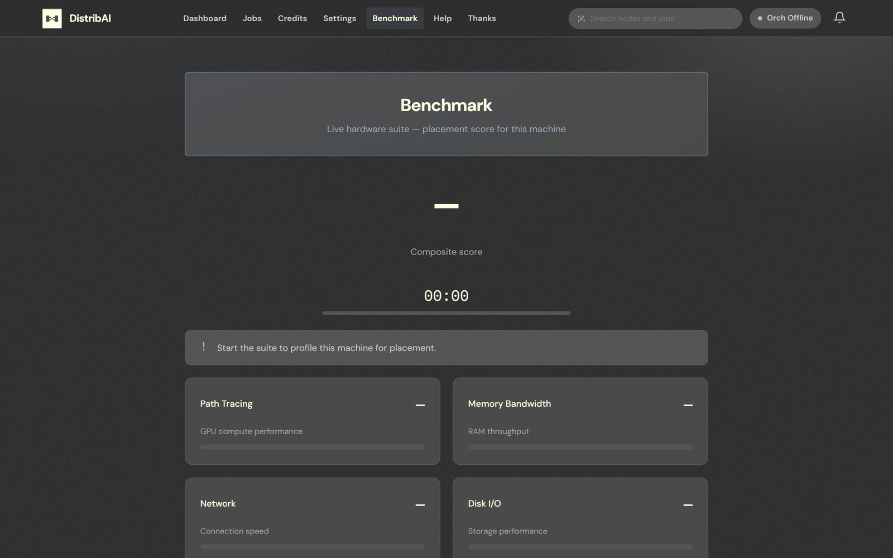
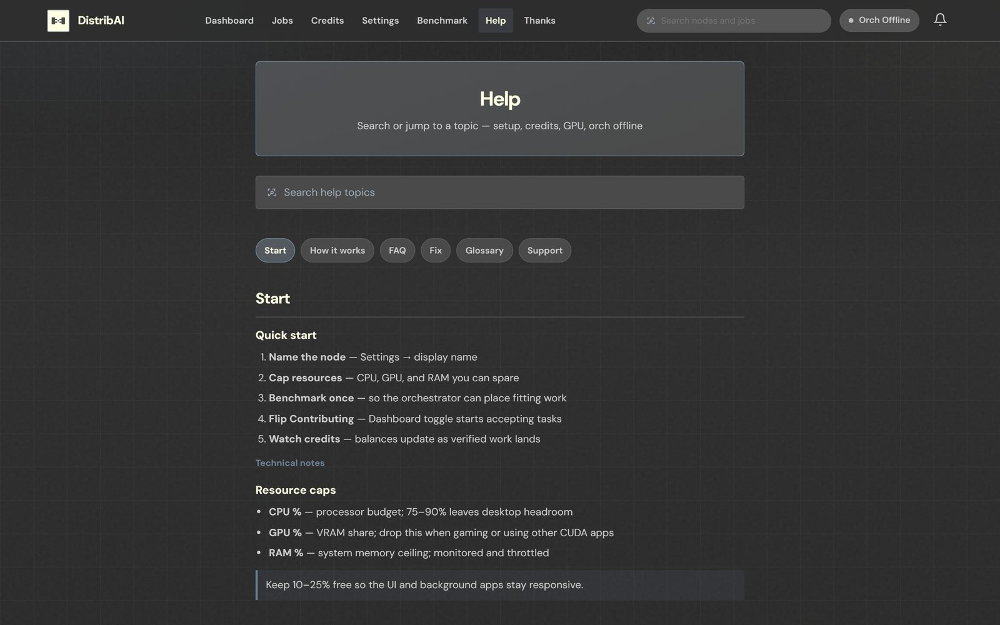
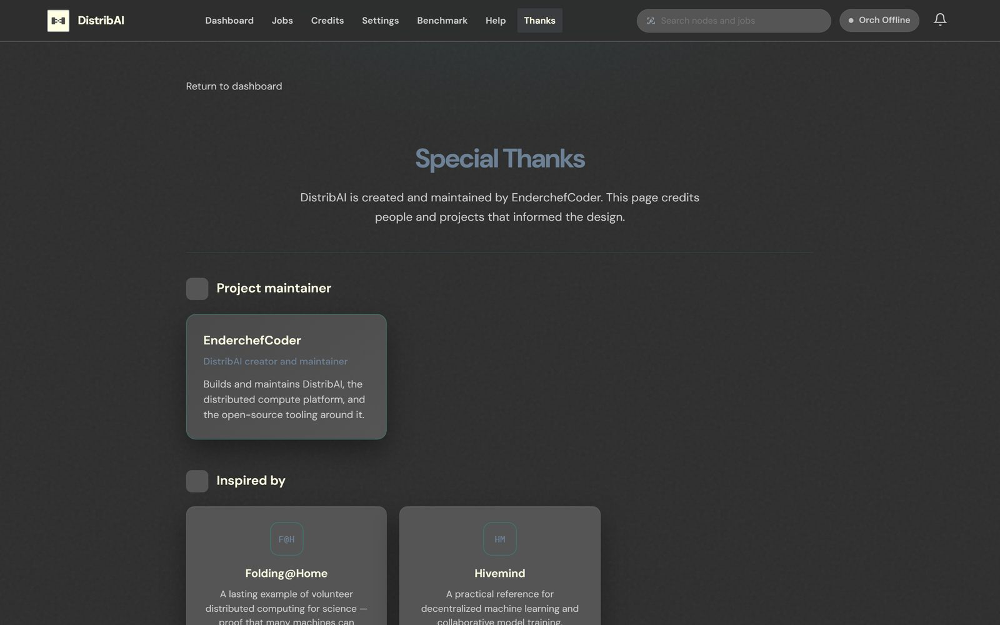
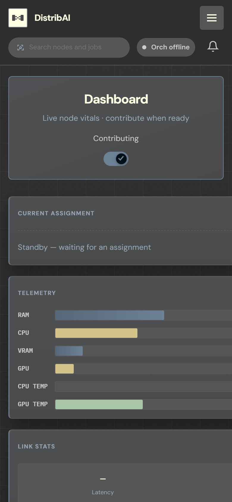
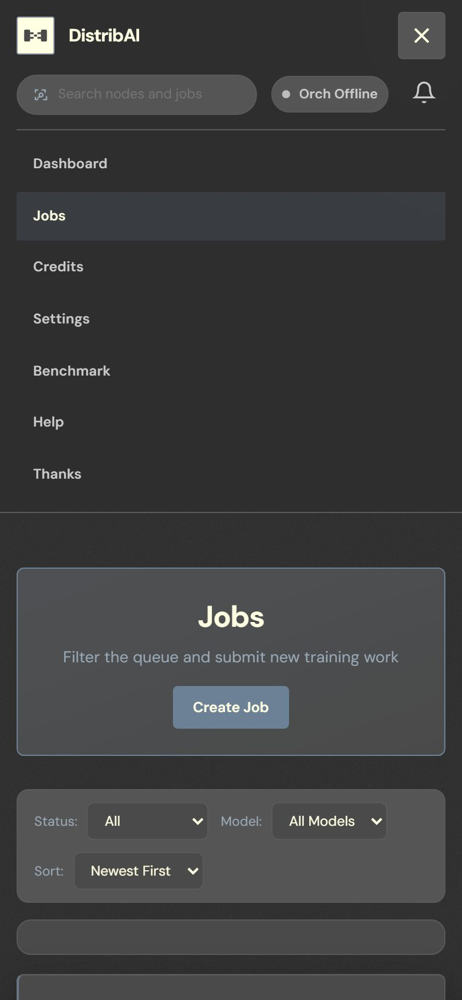

<div align="center">

# DistribAI

**Pool contributor GPUs into real distributed training jobs**

*Orchestrator · worker nodes · contributor & operator dashboards*

<sub>
Note: <a href="https://github.com/CompactAIOfficial/GlintResearchGrid">CompactAIOfficial/GlintResearchGrid</a>
appears to be an unauthorized copy of this project — prefer this repository for the authentic DistribAI source.
</sub>

`mesh` · `credits` · `real stack` · `ink wash UI`

[](#quick-start)
[](LICENSE)
[](TODO.md)
[](https://github.com/naxium-oss/DistribAI/issues)

[Backlog](TODO.md) · [Contributor map](AGENTS.md) · [Docs index](docs/README.md) · [Deploy runbook](docs/runbooks/deployment.md) · [Beta rollout](docs/guides/beta-worker-rollout.md) · [CLI & TUI](#cli--tui) · [Packaging](#packaging)

---

DistribAI is a **real** distributed training control plane:<br/>
an orchestrator schedules micro-tasks over gRPC, contributor nodes execute them,<br/>
and credits land in a signed ledger — not a mock grid.

| Process | Role | Default bind |
| --- | --- | --- |
| `python -m services_python.orchestrator_grpc` | gRPC + admin HTTP | `50051` / `8766` |
| `node client/server.js` | Contributor UI | `0.0.0.0:3000` |
| `node client/orchestrator-server.js` | Operator UI | `127.0.0.1:3212` |

Dashboards: `worker/src/dashboard/static/{node,orch,shared}/`<br/>
Conventions: [AGENTS.md](AGENTS.md) · Config: copy [`.env.example`](.env.example) → `.env`

</div>

---

<div align="center">

## Quick start

Three terminals (defaults match `.env.example`):

</div>

```bash
# 1) Orchestrator
python -m services_python.orchestrator_grpc

# 2) Contributor dashboard
npm install
node client/server.js

# 3) Operator dashboard
node client/orchestrator-server.js
```

<div align="center">

| UI | URL |
| --- | --- |
| Contributor | http://localhost:3000 |
| Operator | http://127.0.0.1:3212 |

**Windows:** use `.\.venv312\Scripts\python.exe -m …` for the orchestrator.

</div>

```bash
npm run verify:boss   # Ruff + unit/security pytest
npm run test:all      # full Python suite
npm run test:ui       # Playwright (safe teardown)
```

<div align="center">

| Harness | When |
| --- | --- |
| `tools/simulate_grid.py` | In-process threaded orch + worker |
| `python -m scripts.dev.simulate_grid_cli` | Subprocess real orch + daemon |
| `pytest tests/e2e/test_e2e.py` | Pytest E2E harness |
| `npm run test:newcomer` | Smallest newcomer slice |

</div>

---

<p align="center">

## Screenshots

Ink-wash contributor UI — two cards per row.

</p>

<p align="center">

&nbsp;&nbsp;

<br/>
<sub><b>Dashboard</b> — vitals &amp; contribution &nbsp;·&nbsp; <b>Jobs</b> — queue &amp; submit work</sub>
</p>

<p align="center">

&nbsp;&nbsp;

<br/>
<sub><b>Settings</b> — identity &amp; caps &nbsp;·&nbsp; <b>Benchmark</b> — placement score</sub>
</p>

<p align="center">

&nbsp;&nbsp;

<br/>
<sub><b>Help</b> — searchable field guide &nbsp;·&nbsp; <b>Thanks</b> — maintainer credits</sub>
</p>

<p align="center">

&nbsp;&nbsp;

<br/>
<sub><b>Mobile</b> — stacked vitals &nbsp;·&nbsp; <b>Mobile</b> — primary navigation</sub>
</p>

<p align="center"><sub>Refresh: <code>node scripts/dev/capture_readme_shots.cjs</code> (UI on <code>:3000</code>)</sub></p>

---

<div align="center">

## How it works

```text
 Organizations ──submit──►  Orchestrator  ◄──gRPC──►  Contributor nodes
                                 │                         │
                            queue · assign            train · report
                                 ▼                         ▼
                            Admin API                 Credits ledger
```

</div>

1. Operators host the orchestrator and publish a join address.
2. Contributors run a node (desktop app, daemon, or [join kit](docs/guides/contributor-join-kit.md)).
3. Jobs split into micro-tasks; nodes pull work, train, and return results.
4. Verified work earns credits; organizations get aggregated outputs.

**For contributors:** download a node build from your operator, set schedule and resource caps, flip **Contributing**. Colab / Kaggle / VPS: [contributor join kit](docs/guides/contributor-join-kit.md).

**For operators:**

```bash
pip install -r requirements.txt
python -m services_python.orchestrator_grpc
node client/server.js
node client/orchestrator-server.js
```

Complete [operator join checklist](docs/runbooks/operator-join-checklist.md) before inviting remote workers. Keep admin/orchestrator source private when shipping contributor binaries only.

---

<div align="center">

## Capabilities

| Area | Today |
| --- | --- |
| Training path | Native PyTorch jobs via `architecture_config` / named profiles |
| Job kinds | train, finetune, RL, inference, benchmark, evaluation, custom |
| Datasets | Alpaca, ShareGPT, Dolly, ChatML, … — [API docs](docs/api/endpoints.md) |
| Credits | SQLite ledger with optional cryptographic mirroring |
| Aggregation | Byzantine-aware (median, trimmed mean, Multi-Krum, …) |
| Packaging | [`specs/`](specs/) · Helm [`deploy/helm/distribai/`](deploy/helm/distribai/) |

**Roadmap (not shipped):** JAX/Flax, TensorFlow/Keras, Apple MLX, ONNX Runtime fast path.

</div>

```bash
distribai node status   # full command reference: "CLI & TUI" section below
```

---

<div align="center">

## CLI & TUI

Headless boxes, CI, and power users get a full terminal surface over the same admin HTTP API the browser dashboards use.

</div>

```bash
pip install -e .    # registers distribai / distribai-cli / distribai-tui
distribai --help    # equivalent: python -m scripts.cli.distribai_cli --help
distribai tui       # equivalent: distribai-tui / python -m scripts.cli.tui
```

<div align="center">

| Command | Does |
| --- | --- |
| `distribai node status` \| `start` \| `stop` \| `logs` | Resource caps + background worker daemon control |
| `distribai node identity` | Show/generate this machine's `org_id` + `node_id` |
| `distribai node set-resources CPU GPU RAM` | e.g. `distribai node set-resources 50 50 50` |
| `distribai node set-name <name>` \| `set-region <region>` | Rename this node / set its region code |
| `distribai orchestrator start` \| `stop` \| `status` \| `logs` | Background orchestrator process control |
| `distribai nodes list` | Fleet view (admin) |
| `distribai credits list` | Credit balances fleet-wide (admin) |
| `distribai job create <model> <steps>` \| `list` \| `status <id>` \| `watch <id>` \| `cancel <id>` | Job lifecycle |
| `distribai submit ./mytrainer` \| `--recipe job.yaml` | Submit a script folder or human job spec as a job |
| `distribai export-weights --format onnx --out model.onnx` | Export a trained model |
| `distribai dashboard node` \| `orchestrator` | Open the matching GUI dashboard in your browser |
| `distribai package info` | Packaging entry points per audience — see [Packaging](#packaging) |
| `distribai health` | One-shot health check |
| `distribai tui` | Interactive terminal dashboard |

</div>

**TUI (`distribai tui`):** Overview / Nodes / Jobs / Credits / Settings / Logs tabs, auto-refreshing every 5s. Keys: `r` refresh · `n` new job · `c` cancel selected job · `s` start/stop the orchestrator · `q` quit.

Every command talks to `ORCHESTRATOR_ADMIN_URL` (default `http://127.0.0.1:8766`); set `DISTRIBAI_ADMIN_SECRET` if the orchestrator requires an admin bearer token. No install needed for one-off use — `python -m scripts.cli.distribai_cli ...` / `python -m scripts.cli.tui` work straight from a repo checkout.

<div align="center">

**The browser dashboards remain the fully-featured surface** — job wizards, benchmark charts, mobile layouts, searchable help.<br/>
The CLI/TUI cover the operational core (fleet, jobs, credits, process control) for terminal-first workflows and CI.

</div>

---

<div align="center">

## Packaging

Three audiences, three artifacts. Full walkthrough (macOS/Linux, NSIS installers, CI examples): [`docs/guides/packaging.md`](docs/guides/packaging.md).

| Audience | Artifact | Build |
| --- | --- | --- |
| **Community** (contributors) | `DistribAI-Node` — worker daemon + node GUI, no orchestrator source | `pyinstaller specs/node-windows.spec` |
| **Org / operator** | `DistribAI-Server` — orchestrator + admin API + dashboards | `pyinstaller specs/server-windows.spec` |
| **Admin** | `distribai-cli` — onefile flat CLI + TUI, no Python install needed | `python scripts/packaging/bundle.py cli` |

</div>

```bash
python scripts/packaging/setup_wizard.py --build-only  # interactive wizard, both platforms specs above

# or per-audience onefile builds via bundle.py:
python scripts/packaging/bundle.py node   # community — safe for public releases
python scripts/packaging/bundle.py admin  # org/operator — keep private, never publish alongside node
python scripts/packaging/bundle.py cli    # admin — CLI + TUI, no Python required on the target box
python scripts/packaging/bundle.py all    # all three + dist/grid-manifest.json
```

Keep orchestrator/admin binaries **out of public release channels** — [`publish_public_grid.py`](scripts/publish/publish_public_grid.py) verifies the public mirror excludes `services_python/`. Contributors without a binary can also `pip install -r requirements-worker.txt` from source instead. Checklists: [operator join checklist](docs/runbooks/operator-join-checklist.md) · [contributor join kit](docs/guides/contributor-join-kit.md).

---

<div align="center">

## Requirements

| Role | Minimum | Recommended |
| --- | --- | --- |
| **Operator** | 4 CPU / 8 GB RAM / 50 GB SSD | 8+ CPU / 16+ GB / SSD + 1 Gbps |
| **Contributor** | CPU fallback · 8 GB RAM | NVIDIA RTX 2060+ · 12+ GB VRAM |

- **OS:** Windows 10+, macOS 12+, Ubuntu 20.04+ (Python **3.11+**)
- **GPU:** NVIDIA CUDA (primary); AMD ROCm / Apple MPS experimental
- **Persistence:** SQLite [`runtime/db/schema.sql`](runtime/db/schema.sql); Redis/S3 optional

</div>

```bash
pip install -r requirements.txt
# pip install -r requirements-cuda.txt   # NVIDIA
npm install
```

---

<div align="center">

## Architecture (sketch)

</div>

```text
services_python/     orchestrator gRPC, admin HTTP, scheduler, credits
worker/              node daemon, compute backends, dashboard static
client/              Express UIs (contributor :3000, operator :3212)
proto/               distribai.proto → regenerate stubs when RPC changes
tests/               unit · integration · e2e · security · performance · chaos
scripts/             cli · dev · ci · maintenance · packaging
docs/                guides, runbooks, API, architecture
```

```text
Node                         Orchestrator
  |--- Register / Heartbeat ------->|
  |<-- TaskAssign ------------------|
  |--- TaskResult ----------------->|
  |<-- Credits ---------------------|
```

Details: [system overview](docs/architecture/system-overview.md) · [gRPC](docs/api/grpc.md) · [HTTP endpoints](docs/api/endpoints.md).

---

<div align="center">

## Security (summary)

| Threat | Mitigation |
| --- | --- |
| Malicious gradients | Byzantine aggregation |
| Sybil / spam joins | Registration challenges, fingerprinting |
| Transport | Optional TLS / mTLS — [guide](docs/guides/tls-and-mtls.md) |
| Sessions | Short-lived JWT |
| Ledger integrity | Hash-chained credit rows with signatures |

Set strong `JWT_SECRET`, `SIGNING_KEY`, and `REDIS_URL` in production.<br/>
See [deployment](docs/runbooks/deployment.md) and [beta pre-prod checklist](docs/runbooks/beta-preprod-checklist.md).

## Documentation

| Topic | Link |
| --- | --- |
| Five-minute onboarding | [guide](docs/guides/five-minute-onboarding.md) |
| Node user guide | [guide](docs/guides/node-user-guide.md) |
| Server operator guide | [guide](docs/guides/server-operator-guide.md) |
| Packaging (community/org/admin builds) | [guide](docs/guides/packaging.md) |
| Environment reference | [guide](docs/guides/environment-reference.md) |
| Troubleshooting | [runbook](docs/runbooks/troubleshooting.md) |
| Ports | [runbook](docs/runbooks/ports.md) |
| Full index | [docs/README.md](docs/README.md) |

## Contributing

</div>

```bash
git clone https://github.com/naxium-oss/DistribAI.git
cd DistribAI
pip install -r requirements.txt
npm install
npm run verify:boss
```

<div align="center">

- Python: PEP 8, tests under [`tests/`](tests/) only
- No mock orchestrator/worker on production paths
- Conventional commits — human-authored; no AI co-author trailers

PR checklist: [AGENTS.md](AGENTS.md) · backlog: [TODO.md](TODO.md)

---

## License

Apache License 2.0 — see [LICENSE](LICENSE).

## Support

**[GitHub Issues](https://github.com/naxium-oss/DistribAI/issues)**

## Acknowledgments

Built and maintained by **EnderchefCoder**, with thanks to testers, node operators, and the federated-learning community.

</div>
