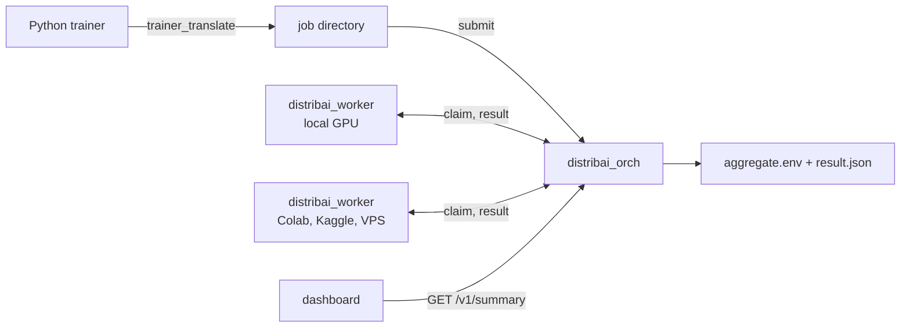
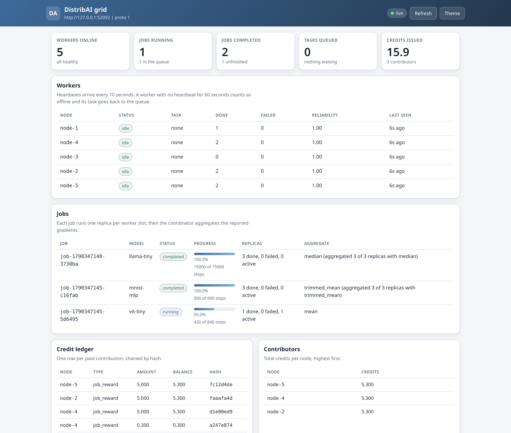
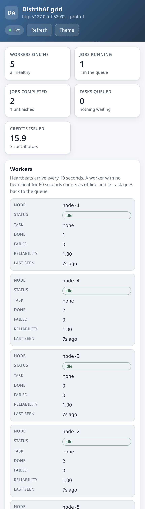

<div align="center">

# DistribAI

**Pool contributor GPUs into real distributed training jobs**

*Native C++ core, LibTorch trainer, native sandbox, C++ coordinator and worker*

`C++20` · `LibTorch` · `SQLite` · `no Python on the train path`

[](LICENSE)
[](tools/cpp_port)
[](legacy/README.md)

[Docs](docs/README.md) · [Quickstart](docs/quickstart.md) · [Architecture](docs/architecture.md) · [Operations](docs/operations.md) · [Agent notes](AGENTS.md)

---

</div>

DistribAI runs training jobs across machines you do not own. Contributors point a
worker at a grid, the grid hands each one a replica of a job, and the coordinator
aggregates what comes back. The whole training path is C++: a dependency-free
tensor engine for the core maths, LibTorch for real models, a native sandbox that
applies rlimits and namespaces to every trainer child, and a coordinator plus
worker pair that speak JSON over HTTP.

## Quick start

```bash
sudo apt-get install -y g++ make libsqlite3-dev    # Debian/Ubuntu
python3 -m venv .venv && .venv/bin/pip install torch

make grid            # coordinator + worker
make torch           # LibTorch trainer

# turn a Python trainer into a runnable job
PYTHONPATH=tools .venv/bin/python -m trainer_translate.translate \
    my_trainer.py --out jobs/hello --steps 200

# run it
build/cpp_port/distribai_orch --port 50061 --db runtime/db/grid.db \
    --jobs-dir runtime/grid/jobs --tasks-dir runtime/grid/tasks &
build/cpp_port/distribai_worker --orchestrator http://127.0.0.1:50061 &
build/cpp_port/distribai_orch --db runtime/db/grid.db --submit jobs/hello --replicas 2
```

The dashboard is at <http://127.0.0.1:50061/>. Results land in
`runtime/grid/jobs/<job_id>/`: per-replica metrics in `result.json` and the
aggregated gradients in `aggregate.env`.


```mermaid
flowchart LR
  T["Python trainer"] -->|trainer_translate| J["job directory"]
  J -->|submit| O["distribai_orch"]
  W1["distribai_worker<br/>local GPU"] <-->|claim, result| O
  W2["distribai_worker<br/>Colab, Kaggle, VPS"] <-->|claim, result| O
  O --> R["aggregate.env + result.json"]
  D["dashboard"] -->|GET /v1/summary| O
```

## The dashboard

The coordinator serves its own dashboard from the same port as the API. It reads
`/v1/summary` every few seconds, so what you see is the live grid: nodes and
their reliability, the job queue with per-replica progress, the credit ledger and
the leaderboard.

<p align="center">
  
</p>

On a phone the same page collapses into cards, one row per record, and keeps the
totals on top:

<p align="center">
  
</p>

Those images come from a real run: five workers, three jobs, a healthy ledger.
Regenerate them with `make screenshots`, which starts a grid, submits work, and
captures the page with headless Chrome.

## What the coordinator does

Each submitted job becomes one task per replica. A worker claims a task over
HTTP, gets the job bundle inline (no shared filesystem), runs the trainer as a
limited child, and reports a GradReport envelope with its gradients. When every
replica has reported, the coordinator aggregates them with mean, median or
trimmed mean, writes the result and pays credits into a hash-chained ledger.

Reliability is handled by silence: a worker that stops heartbeating for
`--node-ttl` seconds has its task returned to the queue, up to three attempts per
task. A job with no surviving replica fails with a reason instead of hanging.

## Join from anywhere, free

```bash
make grid-expose ARGS="--provider cloudflare --port 50061 --invite team-alpha"
```

That publishes the coordinator through a free Cloudflare quick tunnel: no
account, no domain, no paid plan. It prints a `distribai://join?...` link.
Contributors paste it, or open one of the notebooks:

| Where | How |
| --- | --- |
| Local GPU or workstation | `distribai_worker --orchestrator <url> --invite <code>` |
| Google Colab (free GPU) | [`tools/gridlink/notebooks/colab_join.ipynb`](tools/gridlink/notebooks/colab_join.ipynb) |
| Kaggle (free GPU) | [`tools/gridlink/notebooks/kaggle_join.ipynb`](tools/gridlink/notebooks/kaggle_join.ipynb) |
| Molab (free GPU) | [`tools/gridlink/notebooks/molab_join.ipynb`](tools/gridlink/notebooks/molab_join.ipynb) |
| VPS or burst server | the same worker under systemd |
| LAN | `--host` on the LAN interface, share `http://<lan-ip>:50061` |

Local bind stays the default. Nothing is published unless you ask for a provider.
ngrok works too (free tier, needs `NGROK_AUTHTOKEN`).

## Layout

```text
tools/cpp_port/            PRIMARY: engine, sandbox, envelope, ABI, gates
tools/cpp_port/torch/      LIVE TRAIN PATH: LibTorch runner + job spec
tools/cpp_port/grid/       CONTROL PLANE: coordinator, worker, dashboard
tools/trainer_translate/   Python trainer -> C++ job (fails closed)
tools/gridlink/            free tunnels + shareable join links
tools/bench/               run_limited.sh, the mandatory run wrapper
docs/                      quickstart, architecture, operations, testing, migration
runtime/                   db/schema.sql, baselines/, grid/ job data
legacy/                    DEPRECATED Python-era stack (bug fixes only)
```

## Documentation

| Page | Contents |
| --- | --- |
| [Quickstart](docs/quickstart.md) | prerequisites, build, one job, one grid |
| [Architecture](docs/architecture.md) | component, sequence, failure, persistence and trust diagrams |
| [Operations](docs/operations.md) | exposing, capacity, monitoring, backups, drills, security checklist |
| [Testing](docs/testing.md) | every gate, what it proves, how to add one |
| [From Python to C++](docs/from-python-to-cpp.md) | deprecation policy, capability map, porting a behaviour |
| [Native grid](tools/cpp_port/grid/README.md) | protocol reference, worker API, dashboards, file layout |

## Testing

```bash
make test            # engine parity + golden must-match contracts
make torch-test      # Python torch against C++ LibTorch, about 1e-10
make translate-test  # translator, including every fail-closed path
make grid-test       # coordinator + two workers + one job, plus node-loss recovery
make grid-edge-test  # 98 checks: bad messages, gates, assets, failing workers
make grid-regression-test   # the grid bugs that must not come back
make grid-security-test     # admin token, invite, sessions, task ownership
make grid-soak-test  # six workers and twelve jobs in one burst
make usage-test      # run, cancel, restart, resume, read the operator surfaces
make grid-torch-test # a translated script through real LibTorch workers
make trainer-edge-test      # trainer edge cases from real translated fixtures
make suite-json      # the JSON reader and writer, 190 checks
make suite-store     # the SQLite store, 218 checks
make gridlink-test   # link parsing, providers, expose, join
make port-check      # one-shot build, all applicable gates, report
make suite-quick     # wide suite subset plus sanitizers
make ci              # what CI runs
```

`make suite` walks every category; `make suite-quick` skips the long soak and the
differential run. `--only grid` covers the grid's wire layer on its own: 141
checks across base64, JSON, the protocol constants, HTTP request parsing and a
live server, including header floods, oversized bodies, throwing handlers and 64
concurrent clients. `--only store` drives the real SQLite file through
registration, claims, expiry, finalization, credits and a schema migration.
`--only json` pins the reader and the writer, including the depth guard and the
escape round trip.

The grid gates run the real binaries on loopback. The security gate is the one
that asks whether a stranger on the other end of a tunnel can steer the
coordinator; the soak gate is the one that asks whether twelve jobs at once keep
the claims and the ledger straight.

`make port-check` writes `runtime/baselines/cpp_port_check_report.md`. It skips
what the machine cannot run (no `g++` means no LibTorch parity, no `sqlite3.h`
means no grid gate) and says so.

## Legacy

[`legacy/`](legacy/) holds the original Python distributed stack: the gRPC
orchestrator, the worker daemon, the Node dashboards, their tests and their docs.
It still builds and its tests still pass, and it is **deprecated**: bug fixes
only, no new features, no new deployments. The Python train path inside it is
parked, and a dispatch attempt raises unless you set
`DISTRIBAI_ALLOW_LEGACY_TRAIN=1`.

Why it is still in the tree: forks depend on it, and its sandbox and dashboards
are the reference implementations for the port. Postgres-era docs under
`legacy/docs/` carry a deprecation notice and point here.

## License

Apache License 2.0, see [LICENSE](LICENSE).

## Support

[GitHub Issues](https://github.com/naxium-oss/DistribAI/issues)

## Acknowledgments

Built and maintained by EnderchefCoder, with thanks to testers, node operators
and the federated-learning community.
