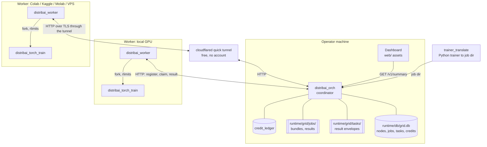
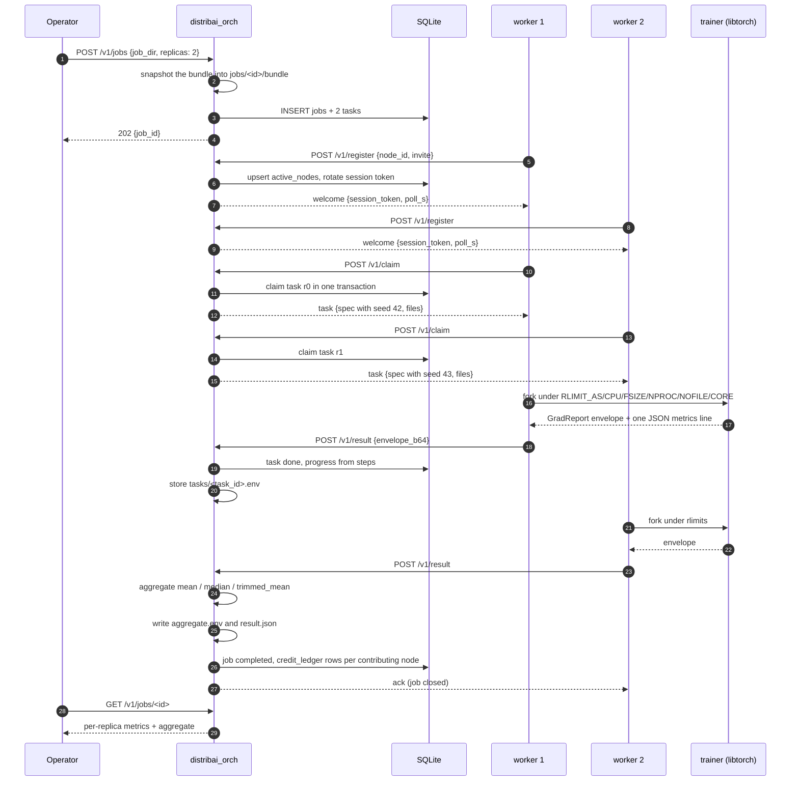
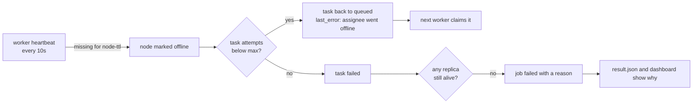
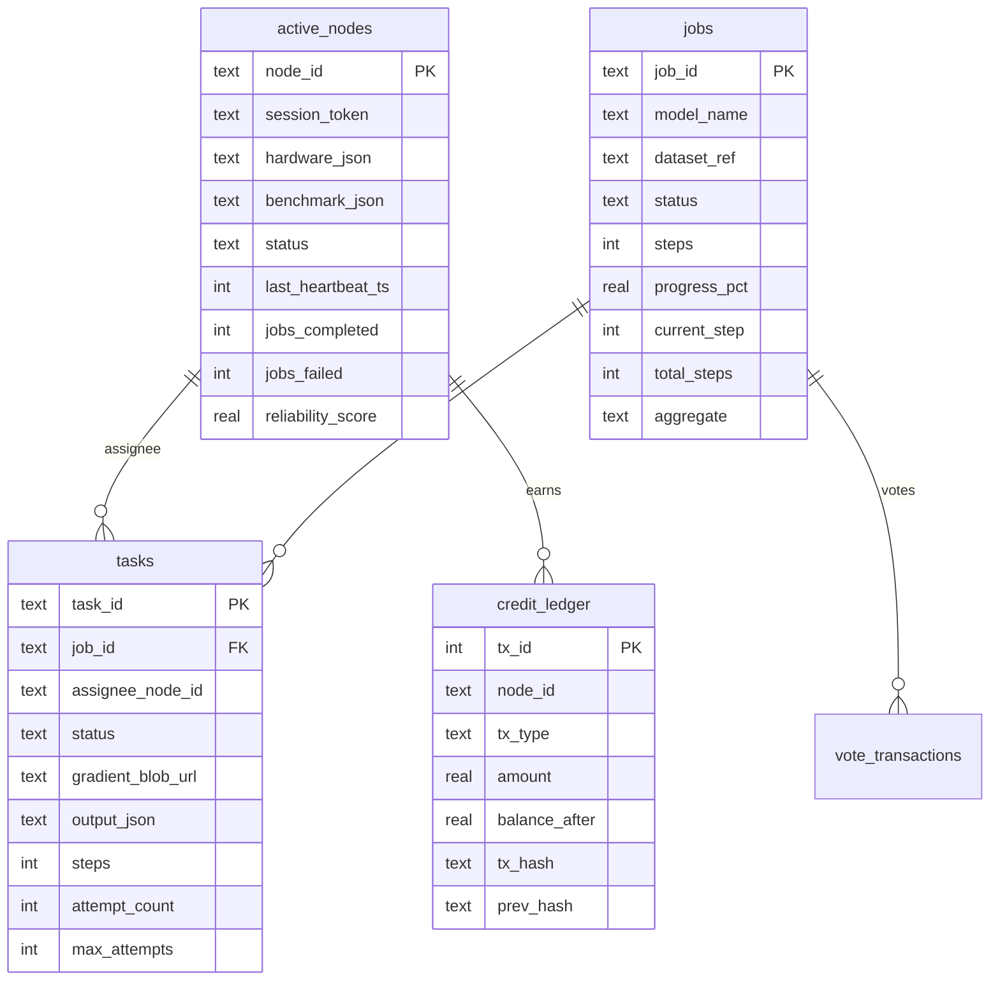
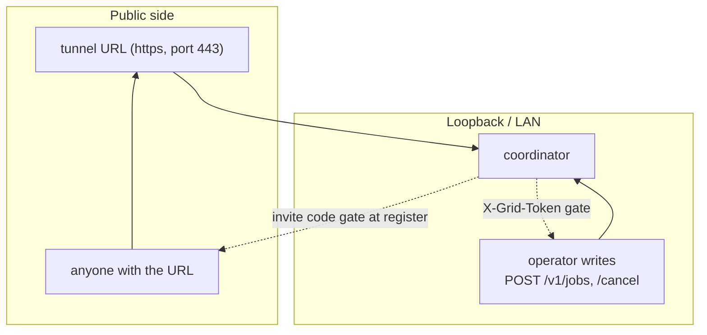
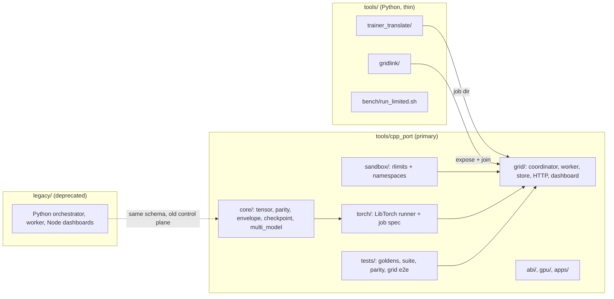

# Architecture

What runs, what talks to what, and where the state lives. Every diagram below is
Mermaid, so it renders on GitHub and in most editors.

---

## The whole system

The coordinator is the only stateful piece. Workers hold no state between
replicas beyond their scratch directory.

---

## One job, end to end

The `aggregate` method travels with the job: the coordinator reads it from the
job's own `job.json` and falls back to its `--aggregate` flag, then stores it on
the job row, so `GET /v1/jobs/<id>` and `result.json` always report the method
that produced the numbers.

The request that reports the last replica closes the job. It marks the job
`finalizing` in one conditional UPDATE, and only the winner writes the aggregate
and the credit rows, so a result arriving at the same moment as the maintenance
sweep cannot pay twice or write two different aggregates. The sweep still runs
every 20 seconds as a safety net for jobs nobody is waiting on any more, and it
returns a job stuck in `finalizing` for more than 30 seconds back to `running`.

---

## Failure handling

A worker that dies mid-task is treated the same way as a network partition:
silence past `--node-ttl` releases the replica. Tasks carry `attempt_count` and
`max_attempts` (3), so a job that kills every worker eventually stops instead of
looping.

A worker is also patient in the other direction. Registration retries for
`--register-wait` seconds (20 by default) when the coordinator cannot be reached
yet, which matters when the worker starts a moment before a tunnel or a
coordinator is ready. A refusal the coordinator actually sent, such as a bad
invite code, is final and is not retried. If a worker's session is rotated out
from under it, the next claim or result re-registers and continues, and a result
whose report fails is retried before the replica is abandoned.

---

## Persistence

Tables come from [`runtime/db/schema.sql`](../runtime/db/schema.sql), which the
coordinator applies at startup. `CREATE TABLE IF NOT EXISTS` leaves an existing
database alone, so columns added later are also applied as a small migration by
hand (currently `jobs.aggregate`); a grid keeps working across an upgrade without
recreating its database. Large or binary values stay out of the database: job
bundles, per-task envelopes and results are files, and the rows hold paths and
metrics.

---

## Trust boundaries

What the design assumes:

- Read endpoints are open. They show node ids, job names, losses and hashes,
  nothing that would let a stranger run work.
- Writes need `X-Grid-Token`. Without a configured token only loopback callers
  may submit or cancel, so an accidental public bind does not accept jobs.
- Worker registration needs the invite code when the coordinator was started
  with `--invite`. Tunnel URLs are public, so set one.
- A session token is bound to the node that registered and is rotated on every
  re-registration, so an old token stops working. A worker may only report on the
  task it was assigned: a result for another node's task is refused, which stops
  a registered stranger from failing or finishing someone else's replica.
- An operator cancel fails the queued and assigned tasks and moves the job to
  `cancelled`. A worker that finishes training afterwards is answered with an
  acknowledgement, but finalization only claims a job that is still `queued` or
  `running`, so a cancelled job never reopens and never writes a result.
- The trainer child inherits no ambient environment beyond `PATH` and `TMPDIR`,
  and runs under rlimits plus its own PID, user and mount namespaces where the
  kernel allows them. See [`native sandbox`](quickstart.md).
- The dashboard never renders worker-supplied strings as HTML: everything goes
  through `textContent`.

---

## Where code lives

The Python tools that remain are the ones where a Python dependency is the point:
`trainer_translate` needs torch to trace a user's trainer, and `gridlink` is a
thirteen-file operator utility. Everything on the training path is C++.

---

## Read next

- [Quickstart](quickstart.md): build and run in a few commands.
- [Operations](operations.md): exposing the grid, capacity, failure drills.
- [Testing](testing.md): the gates and what each one proves.
- [From Python to C++](from-python-to-cpp.md): the deprecation and the mapping.
